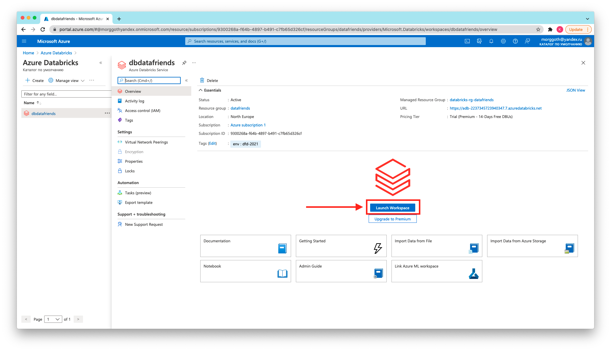

# Data friends day 2021

## Подготовка рабочего окружения

### Регистрация аккаунта в Azure.

Заходим [сюда](https://azure.microsoft.com/ru-ru/free/) и создаём бесплатный аккаунт. Потребуется ввод данных от банковской
карты, однако до тех пор, пока вы явно не смените подписку на платную, деньги с нее списываться не будут. Единственная
операция - списание в возврат $1 для проверки самой карты.

На этом шаге можно либо создать новый аккаунт MicroSoft, либо воспользоваться уже имеющимся аккаунтом Microsoft или Github.

### Установка azure-cli

Идем на [страницу](https://docs.microsoft.com/en-us/cli/azure/install-azure-cli) и следуем инструкции для своей операционной системы.

### Установка terraform

Установка для каждой ОС подробно описана в [официальной документации](https://learn.hashicorp.com/tutorials/terraform/install-cli).

## Деплой инфраструктуры

```bash
# логинимся в az-cli для того, чтобы явно не указывать данные для аутентификации в коде
az login

# переходим в каталог с описанием инфраструктуры в Azure
cd terraform/azure
# инициализируем рабочий каталог terraform
terraform init
# проверяем, что именно он хочет создать
terraform plan
# создаём нашу инфраструктуру
terraform apply
```

Далее нужно запустить Databricks-workspace в консоли Azure, нажав кнопку _Launch workspace_:


После этого, можно задеплоить оставшиеся ресурсы:

```bash
# переходим в каталог с описанием ресурсов в Databricks
cd ../databricks
# создаём файл с переменными и заполняем его
vim dfd.auto.tfvars
# повторяем проделанные ранее действия
terraform init
terraform plan
terraform apply
```

Важно: после окончания работы, не забываем удалить все созданные ресурсы:

```bash
terraform destroy
```